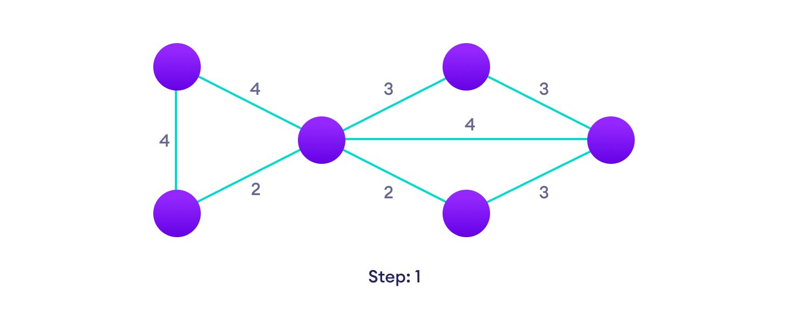
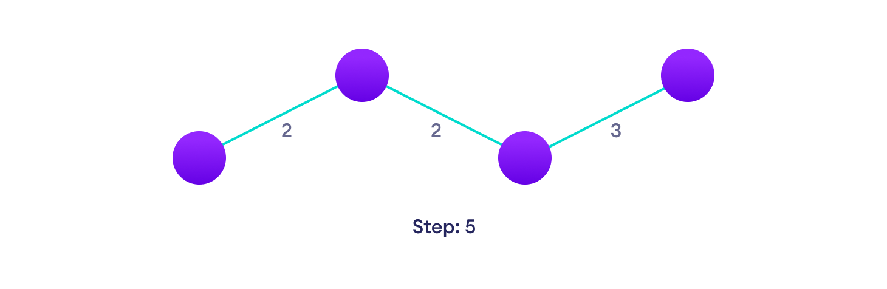
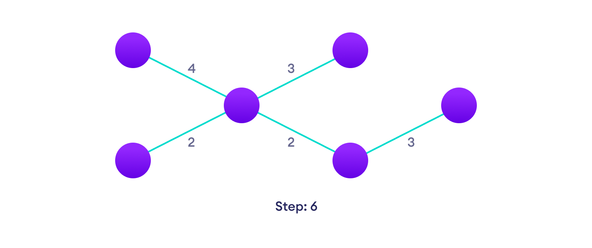

# Prim's Alforithm
- Thuật toán tìm đường đi ngắn nhất mà qua được nhiều nút nhất.
## Giải thuật :
Giả sử có V nút thì số cạnh sẽ là V-1
- Step 1: Khởi tạo đỉnh được chọn đầu tiên là đỉnh thứ 0 và cạnh bằng 0
- Step 2: Lặp cho đến khi số cạnh bằng 4
    + Tìm đường đi ngắn nhất từ đỉnh 0 đến các đỉnh khác (trừ đỉnh 0 và các đỉnh không đến được hay chi phí bằng 0). 
    + Xác định được đỉnh kế tiếp và cũng là đỉnh được chọn
    + Tăng số cạnh lên một và tiếp tục lặp với đỉnh kế tiếp được chọn
- Done

## Examble:
Graph nhìn bằng mắt thường

  

### Step1: Chọn đỉnh

  

### Step2: Tìm đỉnh kế tiếp và xác định cạnh

  

### Step3: Lặp lại step 2

  

### Step4: Tiếp tục lại Step 2

  

### Step5: Done

  

